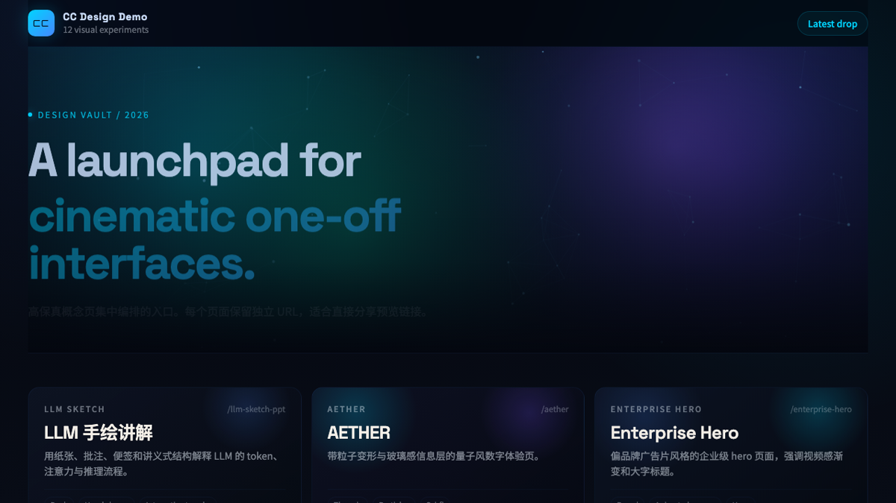
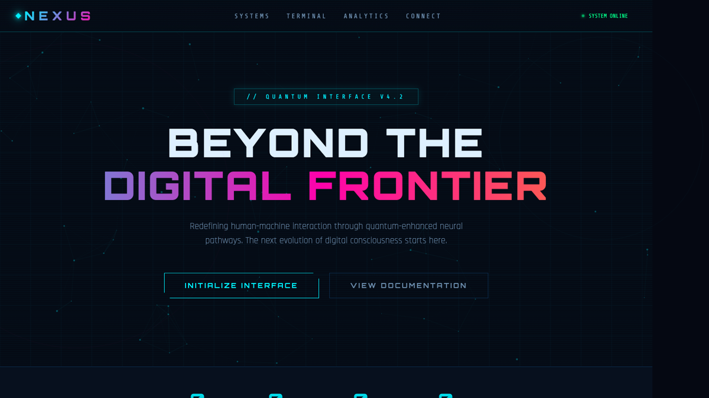
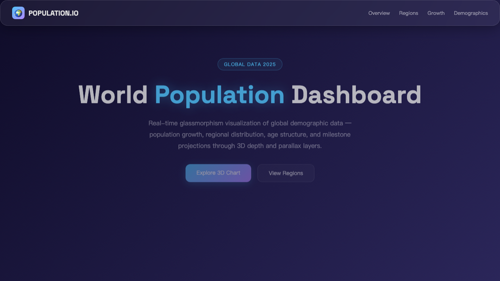

# cc-design

**High-fidelity HTML design for Claude Code & Codex.**

Slide decks, landing pages, interactive prototypes, interactive explainers, animations, design systems, and more — powered by structured design thinking and built-in quality guardrails.

[Demo](https://cc-design-demo.vercel.app) · [Examples](./EXAMPLES.md) · [Report Bug](https://github.com/ZeroZ-lab/cc-design/issues)

---

## Quick Start

### Claude Code

```bash
# 1. Add the cc-design marketplace
/plugin marketplace add ZeroZ-lab/cc-design

# 2. Install the plugin
/plugin install cc-design@cc-design

# 3. Reload plugins to activate
/reload-plugins
```

After installation, cc-design activates via `/cc-design:design` command.

### Codex

```bash
# 1. Add the cc-design marketplace from GitHub
/plugin marketplace add ZeroZ-lab/cc-design

# 2. Install the plugin
/plugin install cc-design@cc-design

# 3. Reload plugins to activate
/reload-plugins
```

After installation, cc-design activates via `$cc-design` reference.

### Example prompts

```
"Design a landing page for our SaaS product"
"Create a 10-slide pitch deck for the Q3 board meeting"
"Build an interactive prototype of the checkout flow"
"Create an interactive explainer showing how our RAG pipeline works"
"Make a comparison explainer for React vs Vue"
"Build a decision tree for tech stack selection"
"Animate this logo reveal with the Pentagram style"
"Export the deck as editable PPTX"
```

cc-design handles context gathering, design planning, quality checks, and verification — you approve the plan, it builds.

## Showcase

[](./screenshots/previews/cc-design-home-preview.png)

<p align="center">
  <a href="./screenshots/previews/cc-design-enterprise-preview.png"></a>
  <a href="./screenshots/previews/cc-design-scifi-preview.png"></a>
  <a href="./screenshots/previews/cc-design-tesla-preview.png"></a>
</p>
<p align="center">
  <a href="./screenshots/previews/cc-design-aether-preview.png"></a>
  <a href="./screenshots/previews/cc-design-glass-preview.png"></a>
  <a href="./screenshots/previews/cc-design-banking-preview.png"></a>
</p>

## Capabilities

| Category | What you get |
|---|---|
| **Design outputs** | Landing pages, slide decks, interactive prototypes, interactive explainers (flow, compare, decision tree), wireframes, animations, design systems, motion studies |
| **Design thinking** | 8-layer framework (Goal → Validation), 10 core principles, 20 philosophy schools |
| **Brand cloning** | Progressive loading of 68+ brand design systems from [getdesign.md](https://getdesign.md) |
| **Quality guardrails** | Always-loaded `core-constraints.md` layer (Iron Law + 12-item anti-slop quick-ref + delivery checklist), typography system, spacing scale, mandatory screenshot verification |
| **Variations** | 3+ design directions across layout, interaction, visual intensity, and motion |
| **Export** | PDF (multi-file + single-file), PPTX (image + editable), MP4 video, inline HTML |
| **Audio** | Dual-track audio (SFX + BGM), 37 SFX catalog, ffmpeg mixing |
| **Design review** | 5-dimension scoring: philosophy, hierarchy, craft, functionality, originality |
| **Animation** | Stage+Sprite timeline engine, easing library, Seek-First numerical verification (`__seek` + `getComputedStyle`), signal protocol, pitfall guardrails |
| **Prototyping** | React + Babel inline JSX, device frames (iOS, Android, macOS, browser) |

## Design Styles

Mention a philosophy school to set the direction:

```
"Use the Pentagram style for this infographic"
"Apply Experimental Jetset minimalism to this poster"
"Mix Takram restraint with Locomotive motion for the hero"
```

20 schools across 5 traditions — Information Architects, Motion Poets, Minimalists, Experimental Vanguard, Eastern Philosophy. See `references/design-styles.md`.

### Brand Style Cloning

Mention a brand name to load its design system:

```
"Create a pricing page with Stripe's aesthetic"
"Notion-style kanban board"
"Mix Vercel's minimalism with Linear's purple accents"
```

## How It Works

```
Understand → Route → Plan → Approve → Build → Verify → Deliver
```

1. **Understand** — cc-design asks targeted questions to lock the output type, audience, and constraints
2. **Plan** — presents a visible execution plan with goals, facts, and assumptions
3. **Approve** — you approve before any code is written
4. **Build** — per-section preview pattern; you approve section by section
5. **Verify** — three-phase self-check (structural, visual, design excellence)
6. **Deliver** — screenshot-verified artifact ready to use

Key behavioral guarantees:
- Never builds without an approved plan
- Never delivers without screenshot verification
- Never uses AI slop patterns (banned gradients, emoji spam, generic layouts)
- Follow-ups and minor edits skip the full discovery flow

## Optional Dependencies

Core installation has no extra dependencies. For export features:

```bash
# Playwright browser (for export and verification)
npx playwright install chromium

# Video and audio export
brew install ffmpeg          # macOS
sudo apt install ffmpeg      # Ubuntu/Debian
choco install ffmpeg         # Windows
```

## Platform Integration

| Platform | Activation | Integration |
|---|---|---|
| **Claude Code** | `/design` command | Commands + SKILL.md |
| **Codex / OpenAI** | `$cc-design` reference | `agents/openai.yaml` |

## Contributing

1. Fork the repo, create a feature branch
2. Keep `SKILL.md` under 200 lines — move technical content to `references/`
3. Add new references to `load-manifest.json` and the routing table in `SKILL.md`
4. Run `node scripts/lint-load-manifest.mjs` and `node scripts/generate-bundle-catalog.mjs`
5. If changing first-turn behavior: update `VERSION`, `SKILL.md`, `README.md`, `references/workflow.md`, then run `./scripts/check-behavior-contract.sh <base-ref>`

## License

MIT


## FAQ

### What is cc-design?

cc-design is a **high-fidelity HTML design skill for Claude Code and Codex**. It creates landing pages, slide decks, interactive prototypes, animations, design systems, and more — with built-in quality guardrails and design thinking.

### What can I create with cc-design?

| Output Type | Description |
|-------------|-------------|
| Landing pages | Marketing pages, product showcases, hero sections |
| Slide decks | Presentations, pitch decks, board meeting slides |
| Interactive prototypes | Clickable UI flows, app walkthroughs |
| Interactive explainers | Flow diagrams, comparisons, decision trees |
| Wireframes | Low-fidelity layout sketches |
| Animations | Logo reveals, motion graphics, UI transitions |
| Design systems | Component libraries, style guides |
| Motion studies | Animation timing, easing experiments |

### How do I install cc-design?

**Claude Code:**
```bash
/plugin marketplace add ZeroZ-lab/cc-design
/plugin install cc-design@cc-design
/reload-plugins
```

**Codex:**
```bash
/plugin marketplace add ZeroZ-lab/cc-design
/plugin install cc-design@cc-design
/reload-plugins
```

### What design styles are available?

20 philosophy schools across 5 traditions:

| Tradition | Schools |
|-----------|---------|
| Information Architects | Tufte, Wurman, Mau |
| Motion Poets | Pentagram, Takram, Locomotive |
| Minimalists | Experimental Jetset, Mu, Hara |
| Experimental Vanguard | Sagmeister, Carson, Vasava |
| Eastern Philosophy | Kenya Hara, Yang Jie |

Use them like: `"Use the Pentagram style for this infographic"`

### Can I clone brand styles?

Yes! Progressive loading of 68+ brand design systems from [getdesign.md](https://getdesign.md).

Examples:
```
"Create a pricing page with Stripe's aesthetic"
"Notion-style kanban board"
"Mix Vercel's minimalism with Linear's purple accents"
```

### What export formats are supported?

| Format | Options |
|--------|---------|
| PDF | Multi-file, single-file |
| PPTX | Image-based, editable |
| MP4 | Video export |
| HTML | Inline, standalone |

### What quality guardrails are built-in?

- **Anti-AI slop rules** — banned gradients, emoji spam, generic layouts
- **Typography system** — consistent fonts, spacing scale
- **Screenshot verification** — mandatory visual check before delivery
- **5-dimension scoring** — philosophy, hierarchy, craft, functionality, originality

### Is cc-design free?

Yes! cc-design is **free and open source** under the MIT License.

### How do I contribute?

1. Fork the repo, create a feature branch
2. Keep `SKILL.md` under 200 lines
3. Add references to `load-manifest.json`
4. Run the lint scripts: `node scripts/lint-load-manifest.mjs`
5. Submit a pull request

### Where can I get help?

| Resource | Link |
|----------|------|
| Demo Gallery | [cc-design-demo.vercel.app](https://cc-design-demo.vercel.app) |
| Examples | [EXAMPLES.md](./EXAMPLES.md) |
| Design Styles | [references/design-styles.md](./references/design-styles.md) |
| Issues | [GitHub Issues](https://github.com/ZeroZ-lab/cc-design/issues) |